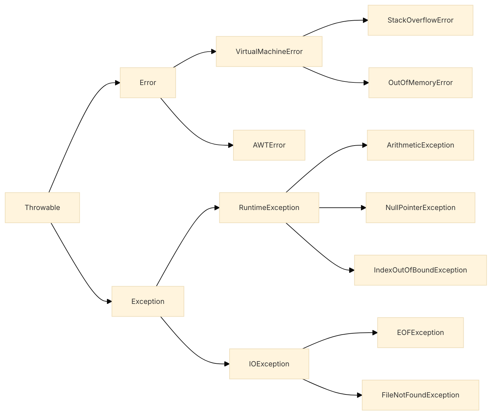

---
aliases:
---

# Exception Handling

> 25-03-2022

```toc

```

## Pendahuluan

**Jenis Kesalahan**:

1. _Syntax Error_, kesalahan sintaks
2. _Semantic Error_, kesalahan makna
3. _Runtime Error_, terminasi program secara tidak normal atau bahkan crash

**Solusi**: Error handling (Penanganan error) dengan _exception_

## Exception

- Merupakan suatu keadaan yang disebabkan oleh runtime error dalam program
- Memungkinkan penanganan kesalahan tanpa mengotori program
- Memungkinkan pemisahan error handling dan program utama

**Kategori Exception**



**Tujuan Exception**

- **Error**: Mengindikasi errornya fatal dimana proses recovery sangat sulit bahkan itdak mungkin dilakukan
- **RuntimeException**: Mengindikasi kesalahan implementasi atau desain program
- Dll

**Langkah-Langkah Bila Terjadi Error**:

1. Secara otomatis akan melempar (_throw_) sebuah object exception
2. Exception akan ditangani oleh fungsi-fungsi error handler
3. Pelemparan exception disebut _throwing exception_, Menerima exception disebut _catch exception_

**Contoh Exception**:

- ArithmeticException -> division by zero
- NullPointerException -> Mengakses objek null
- NegativeArraySizeException -> Membuat array berukuran negatif
- ArrayIndexOutOfBoundException -> mengakses index melebihi ukuran array
- Dll

**Keywords**:

1. `try` : Mencoba kode yang memungkinkan ada exception
2. `catch` : Tempat menerima error
3. `throw`
4. `throws`

![[Pasted image 20220325190435.png]]

## Try, Catch, Finally

- Blok `try` : digunakan untuk menempatkan kode-kode program yang mengandung kode program yang mungkin melemparkan exception
- Blok `catch` : digunakan untuk menempatkan kode-kode program yang digunakan untuk **menangani** sebuah exception tertentu.
- Blok `finally` : digunakan untuk mendefinisikan kode program yang **selalu** dieksekusi baik ada exception yang terjadi maupun bila tidak terjadi exception sama sekali.

```Java
// Try and catch bertingkat
try{
	....
} catch (ExceptionType e1){
	....
} catch (ExceptionType e2){
	....
}
```

## Object Exception

- Object exception yang dihasilkan dapat dimanfaatkan untuk mengetahui lebih lanjut mengenai error atau exception yang terjadi.
- Exception merupakan subclass dari class `Throwable`

**Method yang diwarisi oleh exception**:

1. getMessage() -> Mengembalikan isi pesan untuk menggambarkan exception yang terjadi
2. printStackTrace() -> Menampilkan pesan error dan stack trace ke standart error output stream yang biasanya merupakan konsol window apabila program merupakan CLI
3. PrintStackTrace(PrintStream s) -> Mengembalikan pesan error ke PrintStream yang dijadikan parameter. Jika ingin menampilkan dapat menggunakan `System.out` sebagai parameter

## Membuat Method Exception

- Berlaku bagi kategori exception yg bukan subclass dari RunTimeException.
- Method tertentu dlm program mungkin akan menghasilkan error yang tidak dikenali secara otomatis oleh Java Virtual Machine.
- Dengan cara membuat method yang dapat melempar exception.

![[Pasted image 20220331155555.png]]

## Membuat Exception Baru

- Class exception baru ini harus merupakan subclass dari `java.lang.Exception`
- Hanya boleh mengoverride subclass
  ![[Pasted image 20220331155949.png]]
  ![[Pasted image 20220331160030.png]]
  ![[Pasted image 20220331160040.png]]
  ![[Pasted image 20220331160119.png]]
  ![[Pasted image 20220331160324.png]]
